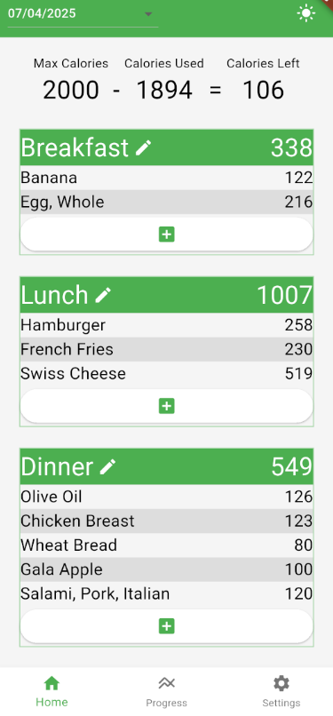
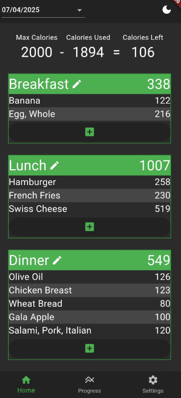
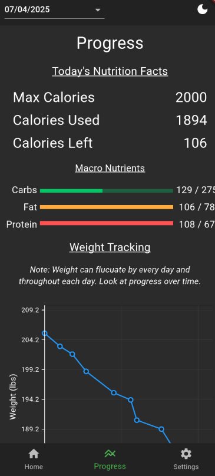
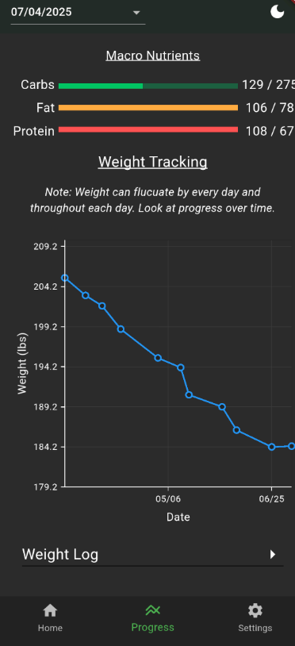
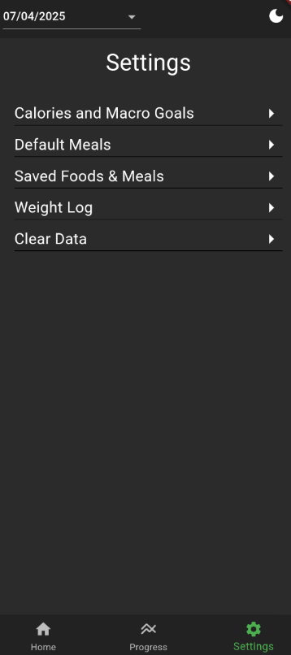
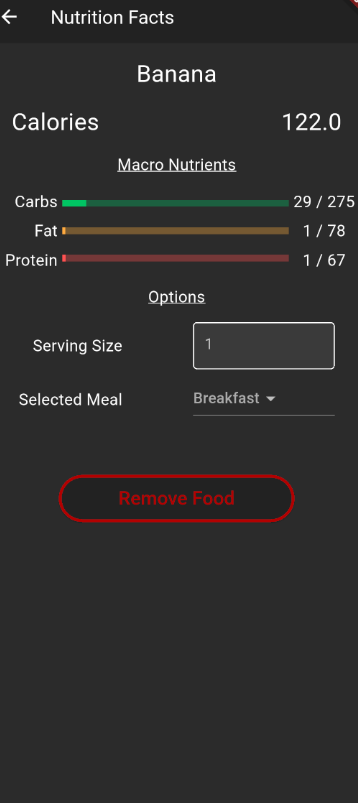
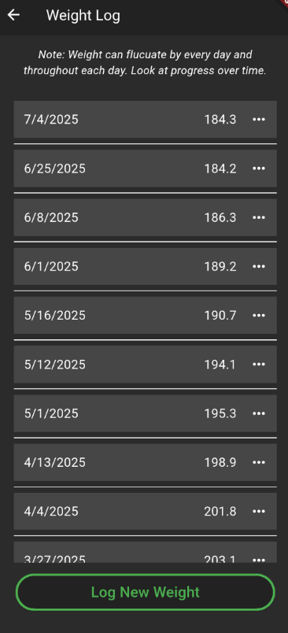
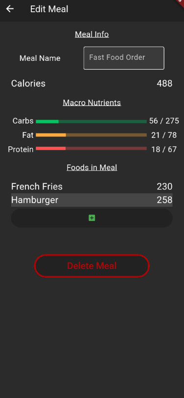

# Calorie Tracker

## Description
A flutter project focused on mobile devices that will track your daily calories and macro nutrients
throughout a day.

This app does not collect any user data. All data is saved on the device locally and
can be deleted at anytime.

## Features
- Manually add food that is saved locally
- Barcode code scanning to automatically add new food
- Create your own user defined meals to easily add foods to daily meals
- Set personal calorie and macro goals
- Set how many daily meals you want and what the name of each meal should be
- Log your weight to see weight loss or gain over time
- Supports a light a dark mode for the UI

# Images
Images of the app in use

